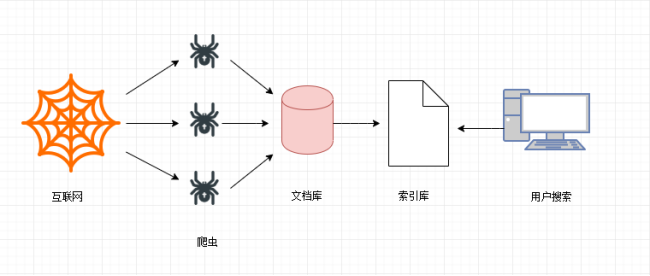
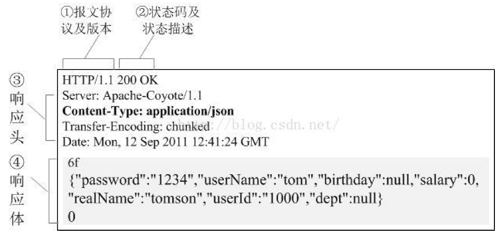
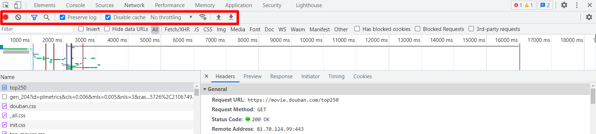
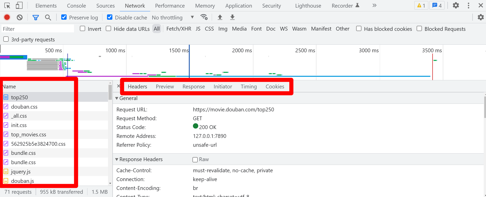

# 一、爬虫是什么

​		网络爬虫（Crawler）又称网络蜘蛛，或者网络机器人（Robots）. 它是一种按照一定的规则， 自动地抓取万维网信息的程序或者脚本。换句话来说，它可以根据网页的链接地址自动获取网页内容。如果把互联网比做一个大蜘蛛网，它里面有许许多多的网页，网络蜘蛛可以获取所有网页的内容。

 		爬虫是一个模拟人类请求网站行为, 并批量下载网站资源的一种程序或自动化脚本。

# 二、爬虫可以做什么

1. 搜索引擎

2. 采集金融数据

3. 采集商品数据

4. 采集竞争对手的客户数据

5. 采集行业相关数据，进行数据分析

6. 刷流量

> **理论上只要是互联网上的数据是肉眼可见的，那么就可以使用爬虫技术做采集。**

# 三、为什么用Python爬虫

1. PHP：PHP是世界是最好的语言！！但他天生不是做这个的，而且对多线程、异步支持不是很好，并发处理能力弱。爬虫是工具性程序，对速度和效率要求比较高。据说目前PHP改善了效率，但是社区环境这一块还是赶不上Python。
2. Java：生态圈很完善，是Python爬虫最大的竞争对手。但是Java语言本身很笨重，代码量很大。重构成本比较高，任何修改会导致代码大量改动。爬虫经常要修改采集代码。毕竟人生苦短。。。。
3. C/C++：运行效率是无敌的。但是学习和开发成本高。写个小爬虫程序可能要大半天时间。一句话总结，为什么不用C++来开发爬虫程序，因为那是要头发掉光的，那是要死人的。
4. Python：语法优美、代码简洁、开发效率高、支持的模块多。相关的HTTP请求模块和HTML解析模块非常丰富。还有Scrapy和Scrapy-redis框架让我们开发爬虫变得异常简单。而且有非常丰富的资源，另外Python也支持异步，对异步的网络编程也非常友好。以后的方向是异步网络编程，非常适合爬虫程序！！

# 四、爬虫的分类

## 4、1 通用爬虫

​		通用网络爬虫是捜索引擎抓取系统（Baidu、Google、Sogou等）的一个重要组成部分。主要目的是将互联网上的网页下载到本地，形成一个互联网内容的镜像备份。为搜索引擎提供搜索支持。

**搜索引擎工作原理：**

- **第一步：抓取网页**

搜索引擎去成千上万个网站抓取数据。

- **第二步：数据存储**

搜索引擎通过爬虫爬取到的网页，将数据存入原始页面数据库(也就是文档库)。其中的页面数据与用户浏览器得到的HTML是完全一样的。

- **第三步：提供检索服务，网站排名**

搜索引擎将爬虫抓取回来的页面，进行各种步骤的预处理：中文分词，消除噪音，索引处理。

搜索引擎在对信息进行组织和处理后，为用户提供关键字检索服务，将用户检索相关的信息展示给用户。展示的时候会进行排名。

**搜索引擎的局限性：**

- 搜索引擎抓取的是整个网页，不是具体详细的信息。

- 搜索引擎无法提供针对具体某个客户需求的搜索结果。

## 4、2 聚焦爬虫

​		针对通用爬虫的这些情况，聚焦爬虫技术得以广泛使用。聚焦爬虫，是"面向特定主题需求"的一种网络爬虫程序，它与通用搜索引擎爬虫的区别在于： **聚焦爬虫在实施网页抓取时会对内容进行处理筛选，尽量保证只抓取与需求相关的网页数据。**

我们课程后续学习的，是 **聚焦爬虫**。

* **编写一个 python 爬虫**

使用 python 编写一个爬虫爬取百度网址

# 五、请求与相应

​		在进行爬虫数据采集的过程中，往往是通过一个**链接地址**向服务器模拟发送请求，从而得到此地址在服务器中的数据。这个地址会遵循互联网数据传输协议:

**协议**

- 协议，意思是共同计议，协商，经过谈判、协商而定制的共同承认、共同遵守的文件。
- 协议，网络协议的简称，网络协议是通信计算机双方必须共同遵从的一组约定。如怎么样建立连接、怎么样互相识别等。只有遵守这个约定，计算机之间才能相互通信交流。

> 爬虫业务场景中最常见就是 **http** 协议

## 5、1 HTTP/HTTPS 协议

* HTTP协议（HyperText Transfer Protocol，超文本传输协议）：是一种发布和接收HTML页面的方法。
* HTTPS（Hypertext Transfer Protocol over Secure Socket Layer）简单讲是HTTP的安全版，在HTTP下加入SSL层。

### 5、1、1 HTTP/HTTPS的优缺点

**HTTP 的缺点：**

* 通信使用明文（不加密），内容可能会被窃听
* 不验证通信方的身份，因此有可能遭遇伪装
* 无法证明报文的完整性，所以有可能已遭篡改

**HTTPS的优点：**

为了解决 HTTP 协议的以上缺点，在上世纪90年代中期，由网景（NetScape）公司设计了 SSL 协议。SSL 是“Secure Sockets Layer”的缩写，中文叫做“**安全套接层**”。

SSL（Secure Sockets Layer 安全套接层）主要用于Web的安全传输协议，在传输层对网络连接进行加密，保障在Internet上数据传输的安全。

## 5、2 请求与响应概述

HTTP通信由两部分组成： **客户端请求消息** 与 **服务器响应消息**

**浏览器发送HTTP请求的过程：**

1. 当我们在浏览器输入URL https://www.baidu.com 的时候，浏览器发送一个Request请求去获取 https://www.baidu.com 的html文件，服务器把Response文件对象发送回给浏览器。
2. 浏览器分析Response中的 HTML，发现其中引用了很多其他文件，比如Images文件，CSS文件，JS文件。 浏览器会自动再次发送Request去获取图片，CSS文件，或者JS文件。
3. 当所有的文件都下载成功后，网页会根据HTML语法结构，完整的显示出来了。

### 5、2、1 请求

#### 5、2、1、1 请求目标（URL）

​		URL又叫作统一资源定位符，是用于完整地描述Internet上网页和其他资源的地址的一种方法。类似于Windows的文件路径。

**一个网址的组成：**

1. http://: 这个是协议，也就是HTTP超文本传输协议，也就是网页在网上传输的协议。
2. mail：这个是服务器名，代表着是一个邮箱服务器，所以是mail。
3. 163.com: 这个是域名，是用来定位网站的独一无二的名字。
4. mail.163.com： 这个是网站名，由服务器名+域名组成。
5. /： 这个是根目录，也就是说，通过网站名找到服务器，然后在服务器存放网页的根目录。
6. index.html： 这个是根目录下的网页。
7. http://mail.163.com/index.html: 这个叫做URL，统一资源定位符，全球性地址，用于定位网上
   的资源。

#### 5、2、1、2 请求体（response）

​		就像打电话一样，HTTP到底和服务器说了什么，才能让服务器返回正确的消息的，其实客户端的请求告诉了服务器这些内容：**请求行**、**请求头部**、**空行**、**请求数据**

> 此请求体对象是http协议中的请求体格式，我们平常一般看不到这样的格式内容。此格式在数据包中会有另外的一种数据格式显示。

#### 5、2、1、3 常用的请求报头

请求头描述了客户端向服务器发送请求时所使用的编码，以及发送内容的长度，告诉服务器自己有没有登陆，采用的什么浏览器访问的等等。

1. `Accept` ：浏览器告诉服务器自己接受什么数据类型，文字，图片等。
2. `Accept-Charset` ：浏览器申明自己接收的字符集。
3. `Accept-Encoding` ：浏览器申明自己接收的编码方法，通常指定压缩方法，是否支持压缩，支持什么压缩方法 (gzip， deflate， br)。
4. `Accept-Language` ：浏览器申明自己接收的语言。
5. `Authorization` ：授权信息，通常出现在对服务器发送的WWW-Authenticate头的应答中。
6. `Content-Length` 表示请求消息正文的长度。
7. `origin` ：声明请求资源的起始位置
8. `Connection` ：处理完这次请求后，是断开连接还是继续保持连接。
9. `Cookie` ：发送给WEB服务器的Cookie内容，经常用来判断是否登陆了。
10. `Host` ：客户端指定自己想访问的WEB服务器的域名/IP 地址和端口号。
11. `If-Modified-Since` ：客户机通过这个头告诉服务器，资源的缓存时间。只有当所请求的内容在指定的时间后又经过修改才返回它，否则返回304“Not Modified”应答。
12. `Pragma` ：指定“no-cache”值表示服务器必须返回一个刷新后的文档，即使它是代理服务器而且已经有了页面的本地拷贝。
13. `Referer` ：告诉服务器该页面从哪个页面链接的。
14. `From` ：请求发送者的email地址，由一些特殊的Web客户程序使用，浏览器不会用到它。
15. `User-Agent` ：浏览器表明自己的身份 (是哪种浏览器)
16. `Upgrade-insecure-requests` ：申明浏览器支持从 http 请求自动升级为 https 请求，并且在以后发送请求的时候都使用 https。

`UA-Pixels,UA-Color,UA-OS,UA-CPU：由某些版本的IE浏览器所发送的非标准的请求头，表示屏幕大小、颜色深度、操作系统和CPU类型。`

#### 5、2、1、4 requests模块查看请求体

​		在我们用requests模块请求数据的时候携带上诉请求报头的字段信息，将我们的爬虫代码进行伪装。同样的伪装之后我们也可以通过代码查看请求体的字段信息，有如下几种常见的属性：

~~~python
# 查看请求体中的url地址
response.request.url
# 查看请求体中的请求头信息
response.request.headers
# 查看请求体中的请求方法
response.request.method
~~~

### 5、2、2 响应

​		响应体就是响应的消息体，如果是纯数据就是返回纯数据，如果请求的是HTML页面，那么返回的就是HTML代码，如果是JS就是JS代码，如此之类。

#### 5、2、2、1 HTTP响应体

HTTP响应报文也由三部分组成：**响应行**、**响应头**、**响应体**

HTTP响应报文格式就如下图所示：

**响应行**

​		响应行一般由协议版本、状态码及其描述组成 比如 HTTP/1.1 200 OK

​		其中协议版本HTTP/1.1或者HTTP/1.0，200就是它的状态码，OK则为它的描述。

**响应头**

​		响应头用于描述服务器的基本信息，以及数据的描述，服务器通过这些数据的描述信息，可以通知客户端如何处理等一会儿它回送的数据。

​		设置HTTP响应头往往和状态码结合起来。例如，有好几个表示“文档位置已经改变”的状态代码都伴随着一个Location头，而401(Unauthorized)状态代码则必须伴随一个WWW-Authenticate头。然而，即使在没有设置特殊含义的状态代码时，指定应答头也是很有用的。应答头可以用来完成：设置Cookie，指定修改日期，指示浏览器按照指定的间隔刷新页面，声明文档的长度以便利用持久HTTP连接等许多其他任务。

#### 5、2、2、2 **常见的响应头字段含义：**

`Allow` ：服务器支持哪些请求方法(如GET、POST等)。

`Content-Encoding` ：文档的编码(Encode)方法。只有在解码之后才可以得到Content-Type头指定的内容类型。利用gzip压缩文档能够显著地减少HTML文档的下载时间。

`Content-Length` ：表示内容长度。只有当浏览器使用持久HTTP连接时才需要这个数据。

`Content- Type` ：表示后面的文档属于什么MIME类型。Servlet默认为text/plain，但通常需要显式地指定为text/html。由于经常要设置 Content-Type，因此HttpServletResponse提供了一个专用的方法setContentType。

`Date` ：当前的GMT时间，例如，Date:Mon，31Dec200104:25:57GMT。Date描述的时间表示世界标准时，换算成本地时间，需要知道用户所在的时区。你可以用setDateHeader来设置这个头以避免转换时间格式的麻烦。

`Expires` ：告诉浏览器把回送的资源缓存多长时间，-1或0则是不缓存。

`Last-Modified` ：文档的最后改动时间。客户可以通过If-Modified-Since请求头提供一个日期，该请求将被视为一个条件GET，只有改动时间迟于指定时间的文档才会返回，否则返回一个304(Not Modified)状态。Last-Modified也可用setDateHeader方法来设置。

`Location` ：这个头配合302状态码使用，用于重定向接收者到一个新 url 地址。表示客户应当到哪里去提取文档。Location通常不是直接设置的，而是通过HttpServletResponse的sendRedirect方法，该方法同时设置状态代码为302。

`Refresh` ：告诉浏览器隔多久刷新一次，以秒计。

`Server` ：服务器通过这个头告诉浏览器服务器的类型。Server响应头包含处理请求的原始服务器的软件信息。此域能包含多个产品标识和注释，产品标识一般按照重要性排序。Servlet一般不设置这个值，而是由Web服务器自己设置。

`Set-Cookie` ：设置和页面关联的Cookie。Servlet不应使用response.setHeader(“Set-Cookie”， …)，而是应使用HttpServletResponse提供的专用方法addCookie。

`Transfer-Encoding` ：告诉浏览器数据的传送格式。

`WWW-Authenticate` ：客户应该在Authorization头中提供什么类型的授权信息?在包含401(Unauthorized)状态行的应答中这个头是必需的。

`setContentType` ：设置Content-Type头。大多数Servlet都要用到这个方法。

`setContentLength` ：设置Content-Length头。对于支持持久HTTP连接的浏览器来说，这个函数是很有用的。

`addCookie` ：设置一个Cookie(Servlet API中没有setCookie方法，因为应答往往包含多个Set-Cookie头)。

#### 5、2、2、3 响应内容

​		响应内容指的就是根据链接地址请求所返回的数据，常见的包括**html**、**css**、**js**、**图片**、**视频**、**音频**等响应的数据。

#### 5、2、2、4 常见的响应方法

~~~python
# 获取响应体文本数据
response.text
# 获取响应体二进制数据
response.content
# 获取响应体json数据
response.json()
# 获取响应体响应头信息
response.headers
# 设置响应体的编码
response.encoding
# 自动识别响应体的编码
response.apparent_encoding
# 获取响应体的cookies信息,获取到的是cookiejar对象
response.cookies
# 获取响应体的url地址
response.url
# 获取响应体的状态码
response.status_code
~~~

#### 5、2、2、5 响应状态码

响应状态码可以很方便的查看我们的响应状态，我们可以检测响应状态码：

1. 200 ：请求正常，服务器正常的返回数据。
2. 301 ：永久重定向。比如在访问www.jingdong.com 的时候会重定向到www.jd.com 。
3. 302 ：临时重定向。比如在访问一个需要登录的页面的时候，而此时没有登录，那么就会重定向
   到登录页面。
4. 400 ：请求的url 在服务器上找不到。换句话说就是请求url 错误。
5. 403 ：服务器拒绝访问，权限不够。
6. 500 ：服务器内部错误。可能是服务器出现bug 了。

# 六、chrome 开发者工具

​		当我们爬取不同的网站是，每个网站页面的实现方式各不相同，我们需要对每个网站都进行分析。那是否有一些通用的分析方法？我分享下自己爬取分析的“套路”。在某个网站上，分析页面以及抓取数据，我用得最多的工具是 **Chrome 开发者工具**。

 		Chrome 开发者工具是一套内置于 Google Chrome 中的 Web 开发和调试工具，可用来对网站进行迭代、调试和分析。因为国内很多浏览器内核都是基于 Chrome 内核，所以国产浏览器也带有这个功能。例如：UC 浏览器、QQ 浏览器、360 浏览器等。

接下来，我们来看看 Chrome 开发者工具一些比较牛逼的功能。

## 6、1 元素面板（Elements)

​		通过元素（Element）面板，我们能查看到想抓取页面渲染内容所在的标签、使用什么 CSS 属性（例如：class="middle"）等内容。例如我想要抓取我知乎主页中的动态标题，在网页页面所在处上右击鼠标，选择“检查”，可进入 Chrome 开发者工具的元素面板。

​		通过这种方法，我们能快速定位出页面某个 DOM 节点，然后可以提取出相关的解析语句。鼠标移动到节点，然后右击鼠标，选择 “Copy”，能快速复制出 Xpath 、CSS selector 等内容解析库的解析语句。

## 6、2 控制台面板（Console）

控制台面板（Console）是用于显示JS和DOM对象信息的单独窗口。

在爬虫课程的js解密专题会用控制台功能调试运行js代码。

## 6、3 资源面板（Source）

在资源面板（Source）页面可以查看到当前网页的所有源文件。

在左侧栏中可以看到源文件以树结构进行展示。
在中间栏这个地方使用来调试js代码的地方。
右侧是断点调试功能区。
在后续js解密会用到资源面板的功能

## 6、4 网络面板（Network）

网络（Network）面板记录页面上每个网络操作的相关信息，包括详细的耗时数据、HTTP 请求与响应标头和 Cookie，等等。这就是我们通常说的抓包。

### 6、4、1 工具栏

**Stop recording network log**

默认情况下，只要开发者工具在开启状态，会记录所有的网络请求，当然，记录都是在Network 面板展示的。红色表示开启，灰色表示关闭。

**Clear**

清空所有数据，每一次重新分析是都需要清空之前的数据。

**Filter**

数据包过滤器。红色表示打开，蓝色表示关闭。

经常来使用它来过滤出一些 HTTP 请求，例如过滤出使用 Ajax 发起的异步请求、图片、视频等。

* **Filter搜索框**

​		根据地址过滤，比如`baidu.com`，就只会过滤数据包地址中包含`baidu.com`的数据包。

* **Invert**

​		Filter搜索框中取反过滤，比如`baidu.com`，会过滤数据包地址中**不包含**`baidu.com`的数据包。

* **Hide data URLs**

​		用于是否隐藏dataurl，那么什么是dataurl呢？传统的通常img标记的src属性指定了一个远程服务器的资源，浏览器针对每个外部资源需要向服务器发送一次拉取资源请求。而Data URL技术是图片数据以base64字符串格式嵌入到了页面中，和HTML融为一体。

* **all：**所有请求数据（图片、视频、音频、js代码、css代码* ）
* **XHR：**XMLHttpRequest 的缩写，是ajax技术的核心，动态加载完成经常分析的一个内容
* **CSS:  **css样式文件
* **JS：**JavaScript文件，是js解密常分析的一个页面
* **Img：** Images 图片文件
* **Font：** 字体文件（字体反扒）
* **DOC ：** Document，文档内容
* **WS:  **WebSocket，web端的socket数据通信，一般用于一些实时更新的数据
* **Wasm**：WebAssembly，WASM（WebAssembly） 垃圾收集。WASM 是一种低级编程语言，源自 Mozilla 发起的 Asm.js 项目，设计提供比 Java 更快速的编译及执行，它允许开发者运用自己熟悉的语言编译，再借虚拟机引擎在浏览器内执行。
* **Manifest：**显示通过manifest缓存的资源。包括很多信息，如js库文件会显示文件地址、大小和
  类型；

* **Has blocked cookies**

​		仅显示具有阻止响应cookie的请求，此选项千万不要勾选。

* **Blocked Requests**

​		仅显示被阻止的请求，此选项千万不要勾选。

* **3rd-party requests**

​		仅显示来源与页面来源不同的请求，此选项千万不要勾选。

**Search**

搜索框，只要在 ALL 里面出现的过的内容，就可以被直接搜索到。常用与数据检索与 JS 解密

**Preserve log**

保留日志。当分析在多个页面跳转的内容时，一定要勾上，不然当页面发生新的跳转是，历史数据全部都会被清空。保留日志，做爬虫是一定需要勾上

**Disable cache**

清空 JavaScript、css 文件的缓存，获取最新的。

**Requests Table**

最大的窗格叫 **Requests Table**，此表格会列出了检索的每一个 HTTP 请求。默认情况下，此表格按时间顺序排序，最早的资源在顶部。点击资源的名称可以显示更多信息。

**Requests Table详情：**
**Headers**：是显示 HTTP 请求的 Headers，我们通过这个能看到请求的方式，以及携带的请求参数等。

* General

  **Request url** ：实际请求的网址
  **Request Method**： 请求方法
  **Status Code** ：状态码，成功时为 200

* Response Headers

  服务器返回时设置的一些数据，例如服务器更新的cookie数据最新是在这里出现修改

* Requests Headers

  请求体，请求不到数据的原因一般出在这里。反扒也是反扒请求体里面的数据

**Preview**

​		Preview 是请求结果的预览。一般用来查看请求到的图片，对于抓取图片网站比较给力。

**Response**

​		Response 是请求返回的结果。一般的内容是整个网站的源代码。如果该请求是异步请求，返回的结果内容一般是 Json 文本数据。

此数据与浏览器展示的网页可能不一致，因为浏览器是动态加载的

**Initiator**

​		请求发起所调用的堆栈

**Timing**

​		请求与响应时间表

**Cookies**

​		显示数据包的cookies所有片段信息

# 课外拓展：HTTP 传输

https://mp.weixin.qq.com/s/aSwXVrz47lAvQ4k0o4VcZg