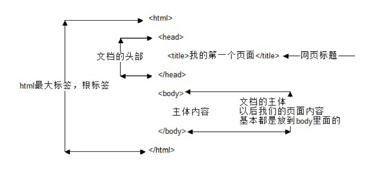

​		对于爬虫中的数据解析，简单理解就是在通用爬虫获取到的响应数据中，进一步提取出我们需要的某些特定数据，是指对网页中指定的内容进行提取的过程。 

# 1、常见数据类型

## 1、1 结构化数据

​		结构化的数据是指可以使用关系型数据库表示和存储，表现为二维形式的数据。一般特点是：数据以行为单位，一行数据表示一个实体的信息，每一行数据的属性是相同的。

## 1、2 半结构化数据

非关系模型的、有基本固定结构模式的数据，例如日志文件、XML文档、JSON文档等。http://www.bejson.com/jsoneditoronline/ 这个也是json文件。

## 1、3 非结构化数据

​		顾名思义，就是没有固定结构的数据。各种文档、图片、视频/音频等都属于非结构化数据。对于这类数据，我们一般直接整体进行存储，而且一般存储为二进制的数据格式。

>**总结：**
>
>能看懂的就是结构化的数据，看不懂的，就是非结构化数据

# 2、HTML概述

* HTML 指的是超文本标记语言 (**H**yper **T**ext **M**arkup **L**anguage)是用来描述网页的一种语言。
* H（很）T（甜）M（蜜）L（啦）
* HTML 不是一种编程语言，而是一种标记语言 (markup language)
* 标记语言是一套标记标签 (markup tag)

**所谓超文本，有2层含义：**

​	1、因为它可以加入图片、声音、动画、多媒体等内容（**超越文本限制** ）

​	2、不仅如此，它还可以从一个文件跳转到另一个文件，与世界各地主机的文件连接（**超级链接文本**
）。

~~~html
<h1> 我是一个大标题 </h1>
~~~

**一句话说出他们:**

>网页是由网页元素组成的 ， 这些元素是利用html标签描述出来，然后通过浏览器解析，就可以显
>示给用户了。

**门外汉眼中的效果页面**

**爬虫工程是中的页面**

### 2、1 HTML骨架格式

日常生活的书信，我们要遵循共同的约定。

同理：HTML 有自己的语言语法骨架格式：（要遵循，要专业） 要求务必非常流畅的默写下来。

~~~html
<html>
	<head>
		<title></title>
	</head>
	<body>
	</body>
</html>
~~~

#### **html骨架标签总结**

| 标签名             |    定义    | 说明                                                    |
| ------------------ | :--------: | :------------------------------------------------------ |
| `<html></html>`    |  HTML标签  | 页面中最大的标签，我们成为  根标签                      |
| `<head></head>`    | 文档的头部 | 注意在head标签中我们必须要设置的标签是title             |
| `<titile></title>` | 文档的标题 | 让页面拥有一个属于自己的网页标题                        |
| `<body></body>`    | 文档的主体 | 元素包含文档的所有内容，页面内容 基本都是放到body里面的 |

**课堂练习：**

书写我们的第一个HTML 页面。

1. 新建一个demo 的 TXT 文件。

2. 里面写入刚才的HTML 骨架。

3. 把后缀名改为 .HTML。

4. 右击--谷歌浏览器打开。

   ~~~html
   <html>
       <head>
       	<title>我的第一个页面</title>
       </head>
   	<body>
   		hello world ！
   	</body>
   </html>
   ~~~

   

为了便于记忆，我们请出刚才要辞职回家养猪的二师兄来帮忙， 我称之为 猪八戒记忆法

### 2、2 HTML标签关系

​		主要针对于双标签 的相互关系分为两种： 请大家务必熟悉记住这种标签关系，因为后面我们标签嵌套特别多，很容易弄混他们的关系。

 1. 嵌套关系

    ~~~html
    <head>
    	<title> </title>
    </head>
    ~~~

    

    2.并列关系

    ~~~html
    <head></head>
    <body></body>
    ~~~

    

    **倡议：**

    >~~~
    >如果两个标签之间的关系是嵌套关系，子元素最好缩进一个tab键的身位（一个tab是4个空格）。如果是并列关系，最好上下对齐。
    >~~~

    **一句话说出他们:**

    >html双标签可以分为: 一种是 **父子级** 包含关系的标签 一种是 **兄弟级** 并列关系的标签

# 3、CSS选择器

​		在 CSS 中，选择器是一种模式，用于选择需要添加样式的元素。那么我们就可以使用css选择器，在html中找到数据所对应的标签。此方式也是一个专门在html中提取数据的方法。

| 选择器              | 例子       | 例子描述                                 |
| :------------------ | :--------- | :--------------------------------------- |
| .*class*            | .intro     | 选择 class="intro" 的所有元素。          |
| #id                 | #firstname | 选择 id="firstname" 的所有元素。         |
| *                   | *          | 选择所有元素。                           |
| element             | p          | 选择所有 
 元素。                      |
| *element*,*element* | div,p      | 选择所有 
 元素和所有 
 元素。     |
| *element* *element* | div p      | 选择 
 元素内部的所有 
 元素。     |
| *element*>*element* | div>p      | 选择父元素为 
 元素的所有 
 元素。 |
| [*attribute*\]      | [target]   | 选择带有 target 属性所有元素。           |

## 3、1 标签选择器

​		标签选择器其实就是我们经常说的html代码中的标签。例如**html**、**span**、**p**、**div**、**a**、**img**等等；比如我们想要设置网页中的p标签内一段文字的字体和颜色，那么css代码就如下所示：

~~~python
# 简化的html标签
html = """
<!DOCTYPE html>
<html lang="en">
<head>
	<meta charset="UTF-8">
	<title>标签选择器</title>
</head>

<body>
	
css标签选择器的介绍

	
标签选择器、类选择器、ID选择器

	<a href="https://www.baidu.com">百度一下</a>
	 我是一个span标签
</body>
</html>
"""
import parsel

selector = parsel.Selector(html)

span = selector.css('span').getall()
print(span)
~~~

## 3、2 类选择器

​		类选择器在我们今后的css样式编码中是最常用到的，它是通过为元素设置单独的class来赋予元素样式效果。**使用语法**：（我们这里为p标签单独设置一个class类属性,代码就如下所示）

~~~python
# 简化的html标签
html = """
<!DOCTYPE html>
<html lang="en">
<head>
	<meta charset="UTF-8">
	<title>标签选择器</title>
</head>

<body>
	
css标签选择器的介绍

	
标签选择器、类选择器、ID选择器

	<a href="https://www.baidu.com">百度一下</a>
	 我是一个span标签
</body>
</html>
"""
import parsel

selector = parsel.Selector(html)

p = selector.css('.top').getall()
print(p)
~~~

**详细讲解：**

​	1、类选择器都是使用英文圆点（.）开头；

​	2、每个元素可以有多个类名，，名称可以任意起名（但不要起中文，一般都是与内容相关的英文缩写）

## 3、3 ID选择器

ID选择器类似于类选择符，作用同类选择符相同，但也有一些重要的区别。

**使用语法：**

~~~python
# 简化的html标签
html = """
<!DOCTYPE html>
<html lang="en">
<head>
	<meta charset="UTF-8">
	<title>标签选择器</title>
</head>

<body>
	
css标签选择器的介绍

	
标签选择器、类选择器、ID选择器

	<a href="https://www.baidu.com">百度一下</a>
	 我是一个span标签
</body>
</html>
"""
import parsel

selector = parsel.Selector(html)

p = selector.css('#content').getall()
print(p)
~~~

**详细讲解：**

​	1、ID选择器为标签设置id="ID名称"，而不是class="类名称"。

​	2、ID选择符的前面是符号为井号（#），而不是英文圆点（.）。

​	3、ID选择器的名称是唯一的，即相同名称的id选择器在一个页面只能出现一次；

## 3、4 组合选择器

可以多个选择器一起使用，就是组合选择器

## 3、5 伪类选择器

可以用 ` :` 指定选择想要提取的第几个标签。

| 语法               | 示例                | 描述                                |
| ------------------ | ------------------- | ----------------------------------- |
| :last-of-type      | p:last-of-type      | 选择满足p语法元素的最后一个元素     |
| :not(selector)     | :not(p)             | 选择所有p以外的元素                 |
| :nth-child(n)      | p:nth-child(2)      | 选择满足p语法元素的第二个元素       |
| :nth-last-child(n) | p:nth-last-child(2) | 选择满足p语法元素的倒数的第二个元素 |

案例：

~~~PYTHON
# 简化的html标签
html = """
<!DOCTYPE html>
<html lang="en">
<head>
	<meta charset="UTF-8">
	<title>标签选择器</title>
</head>

<body>
	
css标签选择器的介绍

	
标签选择器、类选择器、ID选择器

	<a href="https://www.baidu.com">百度一下</a>
	 我是一个span标签
</body>
</html>
"""
import parsel
selector = parsel.Selector(html)
p = selector.css('p:nth-child(2)').getall()
print(p)
~~~

## 3、6 属性提取器

可以用 ` ::` 提取标签包含的属性。

~~~python
# 简化的html标签
html = """
<!DOCTYPE html>
<html lang="en">
<head>
	<meta charset="UTF-8">
	<title>标签选择器</title>
</head>

<body>
	
css标签选择器的介绍

	
标签选择器、类选择器、ID选择器

	<a href="https://www.baidu.com">百度一下</a>
	 我是一个span标签
</body>
</html>
"""
import parsel
selector = parsel.Selector(html)
p = selector.css('p::text').getall()
print(p)
a = selector.css('a::attr(href)').get()
print(a)
~~~

## 3、7 小结

* `标签名` 表示标签选择器，根据标签的名字定位标签
* `.` 表示类选择器，根据标签的class属性定位。class属性中包含空格需要用 `.` 代替
* `#` 表示ID选择器，根据标签的id属性定位。一般在html中id属性唯一
* `:` 表示伪类选择器，同级标签中选取指定的第几个标签
* `::` 表示属性提取器，根据已定位的标签对象中的属性名，提取其属性对应的值
* `空格` 在css语法中表示取后代标签，只要是在嵌套下的标签，不论嵌套几层都可以定位
* `>` 在css语法中表示取子标签，且仅取子标签

# 4、xpath节点提取

## 4、1 什么是xpath

​		**XPath** (XML Path Language) 是一门在 HTML\XML 文档中查找信息的**语言**，可用来在 HTML\XML 文档中对**元素和属性进行遍历**。

W3School官方文档：http://www.w3school.com.cn/xpath/index.asp

## 4、2 认识xml

知识点：

* html和xml的区别
* xml中各个元素的的关系和属性

### 4、2、1 html和xml的区别

### 4、2、2 xml的树结构

~~~xml
<bookstore>
<book category="COOKING">
  <title lang="en">Everyday Italian</title> 
  <author>Giada De Laurentiis</author> 
  <year>2005</year> 
  <price>30.00</price> 
</book>
<book category="CHILDREN">
  <title lang="en">Harry Potter</title> 
  <author>J K. Rowling</author> 
  <year>2005</year> 
  <price>29.99</price> 
</book>
<book category="WEB">
  <title lang="en">Learning XML</title> 
  <author>Erik T. Ray</author> 
  <year>2003</year> 
  <price>39.95</price> 
</book>
</bookstore>
~~~

上面的xml内容可以表示为下面的树结构

上面的这种结构关系在xpath被进一步细化

## 4、3 xpath的节点关系

知识点：

* 认识xpath中的节点
* 了解xpath中节点之间的关系
* 每个html的标签我们都称之为节点。（根节点、子节点、同级节点）

## 4、4 xpath语法

**XPath** 使用路径表达式来选取 XML 文档中的节点或者节点集。这些路径表达式和我们在常规的**电脑文件系统中看到的表达式**非常相似。

**下面列出了最有用的表达式：**

| 表达式   | 描述                                                         |
| -------- | ------------------------------------------------------------ |
| nodename | 选中该元素。                                                 |
| /        | 从根节点选取、或者是元素和元素间的过渡。                     |
| //       | 从匹配选择的当前节点选择文档中的节点，而不考虑它们的位置。跨节点获取标签 |
| .        | 选取当前节点。                                               |
| ..       | 选取当前节点的父节点。                                       |
| @        | 定位, 选取属性值                                             |
| text()   | 选取文本。                                                   |

在下面的表格中，我们已列出了一些路径表达式以及表达式的结果：

| 路径表达式          | 结果                                                         |
| ------------------- | ------------------------------------------------------------ |
| bookstore           | 选择bookstore元素。                                          |
| /bookstore          | 选取根元素 bookstore。注释：假如路径起始于正斜杠( / )，则此路径始终代表到某元素的绝对路径！ |
| bookstore/book      | 选取属于 bookstore 的子元素的所有 book 元素。                |
| //book              | 选取所有 book 子元素，而不管它们在文档中的位置。             |
| bookstore//book     | 选择属于 bookstore 元素的后代的所有 book 元素，而不管它们位于 bookstore 之下的什么位置。 |
| //book/title/@lang  | 选择所有的book下面的title中的lang属性的值。                  |
| //book/title/text() | 选择所有的book下面的title的文本。                            |

* 选取未知节点

| 通配符 | 描述                 |
| ------ | -------------------- |
| *      | 匹配任何元素节点。   |
| @*     | 匹配任何属性节点。   |
| node() | 匹配任何类型的节点。 |

在下面的表格中，我们列出了一些路径表达式，以及这些表达式的结果：

| 路径表达式   | 结果                              |
| ------------ | --------------------------------- |
| /bookstore/* | 选取 bookstore 元素的所有子元素。 |
| //*          | 选取文档中的所有元素。            |
| //title[@*]  | 选取所有带有属性的 title 元素。   |

* 案例

  ~~~html
          
 
              <ul> 
                  <li class="item-1">
                      <a href="link1.html">第一个</a>
                  </li> 
                  
                  <li class="item-2">
                      <a href="link2.html">第二个</a>
                  </li> 
                  
                  <li class="item-3">
                      <a href="link3.html">第三个</a>
                  </li> 
                  
                  <li class="item-4">
                      <a href="link4.html">第四个</a>
                  </li> 
                  
                  <li class="item-5">
                      <a href="link5.html">第五个</a> 
                  </li>
              </ul>
          

  ~~~

  ~~~python
  import parsel  # str --> Selector对象   具有xpath方法   提取到的数据返回一个列表
  
  html_str = """
          
 
              <ul> 
                  <li class="item-1">
                      <a href="link1.html">第一个</a>
                  </li> 
                  
                  <li class="item-2">
                      <a href="link2.html">第二个</a>
                  </li> 
                  
                  <li class="item-3">
                      <a href="link3.html">第三个</a>
                  </li> 
                  
                  <li class="item-4">
                      <a href="link4.html">第四个</a>
                  </li> 
                  
                  <li class="item-5">
                      <a href="link5.html">第五个</a> 
                  </li>
              </ul>
          

      """
  # 1、转换数据类型
  # data = parsel.Selector(html_str).extract()  # parsel能够把缺失的html标签补充完成
  data = parsel.Selector(html_str)  # parsel能够把缺失的html标签补充完成
  # 2、解析数据--list类型
  # print(data)
  # 2、1 从根节点开始，获取所有<a>标签
  result = data.xpath('/html/body/div/ul/li/a').extract()
  # 2、2 跨节点获取所有<a>标签
  result = data.xpath('//a').extract()
  # 2、3 选取当前节点   使用场景：需要对选取的标签的下一级标签进行多次提取
  result = data.xpath('//ul')
  result2 = result.xpath('./li').extract()    # 提取当前节点下的<li>标签
  result3 = result.xpath('./li/a').extract()  # 提取当前节点下的<a>标签
  # 2、4 选取当前节点的父节点,获取父节点的class属性值
  result = data.xpath('//a')
  result4 = result.xpath('../@class').extract()
  # 2、5 获取第三个<li>标签的节点（两种方法）
  result = data.xpath('//li[3]').extract()
  result = data.xpath('//li')[2].extract()
  # 2、6 通过定位属性的方法获取第四个<a>标签
  result = data.xpath('//a[@href="link4.html"]').extract()
  # 2、7 用属性定位标签，获取第四个<a>标签包裹的文本内容
  result = data.xpath('//a[@href="link4.html"]/text()').extract()
  # 2、8 获取第五个<a>标签的href属性值
  result = data.xpath('//li[5]/a/@href').extract()
  # 了解 模糊查询
  result = data.xpath('//li[contains(@class,"it")]').extract()
  # 同时获取<li>标签的属性以及<a>标签的文本
  # result = data.xpath('//li/@class|//a/text()').extract()
  
  print(result)
  ~~~

* 如何选取多个标签？

  通过在路径表达式中使用“|”运算符，您可以选取若干个路径。（逻辑运算符）

## 4、5 小结

1. xpath的概述XPath (XML Path Language),解析查找提取信息的语言
2. xpath的节点关系:根节点,子节点,同级节点
3. xpath的重点语法获取任意节点:`//`
4. xpath的重点语法根据属性获取节点:`标签[@属性 = '值']`
5. xpath中获取节点的文本：`text（）`
6. xpath的获取节点属性值:`@属性名`