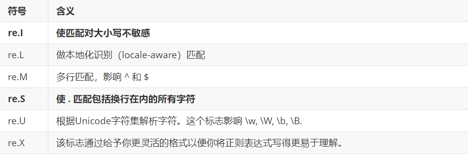

## 1、正则表达式

​		**正则表达式**，又称规则表达式。（英语：Regular Expression，在代码中常简写为regex、regexp或RE），计算机科学的一个概念。正则表达式通常被用来检索、替换那些符合某个模式(规则)的文本。——百度百科

下面是正则表达式常见的使用场景：
1. 检查字符串的合法性
* 验证用户名 （a-z，0-9，不能全是数字，不能全是字母）
* 验证邮箱格式 (xxx@qq.com)
* 验证电话号码 (11位数字)
* 验证身份证 (18位 )
* 验证QQ号码格式（5-12纯数字，第一位不能为0）；

2. 提取字符串中信息
* 提取一条短信中数字；
* 提取文件名的后缀；
* **采集器(网络爬虫)**

3. 替换字符串
* 替换字符串中的非法字符；
* 对电话号码进行屏蔽；（18520102）
* 替换占位符 “hello {{name}} ” hello 王老二 （模板框架）

4. 分割字符串
* 将一个字符串按照指定的规则进行分割；

在爬虫中，使用正则表达式提取我们想要的数据。去掉多余的数据。

**场景：找所有邮件地址**

>百度贴吧邮箱信息：http://tieba.baidu.com/p/5781191467

~~~
text = """
回复(2)4楼2018-07-04 11:48

哥哥口袋有糖
初识物联1
346504108@qq.com

收起回复5楼2018-07-04 14:10

Super劫Zed: 540775360@qq.com
2018-8-8 16:00回复
我也说一句

RAVV2017
物联硕士4
以上的邮箱，已发，还需要的请回复邮箱。两套物联网学习资料。

回复(4)7楼2018-07-04 16:06

儒雅的刘飞3
初识物联1
397872410@qq.com，谢谢楼主

收起回复8楼2018-07-04 16:20

RAVV2017: 已发送，麻烦请查收，谢谢
2018-7-4 16:23回复
我也说一句
 
该来的总会来
物联博士5
1459543548@qq.com
谢谢谢谢

回复9楼2018-07-04 17:18来自Android客户端
BLACKPINK_罗捷
深入物联2
1228074244@qq.com
"""
~~~

### 1、1 元字符

> 使用元字符匹配单个字符

| 字符 | 功能                                                   |
| ---- | ------------------------------------------------------ |
| .    | 匹配任意1个字符（除了\n）                              |
| [ ]  | 匹配[ ]中列举的字符                                    |
| \d   | 匹配数字，即0-9                                        |
| \D   | 匹配非数字，即不是数字                                 |
| \s   | 匹配空白，即 空格，tab键，换行                         |
| \S   | 匹配非空白（数字、英文字符、特殊符号）                 |
| \w   | 匹配单词字符，即a-z、A-Z、0-9、_、包括各个国家语言文字 |
| \W   | 匹配非单词字符                                         |
| *    | 匹配前一个字符出现0次或者无限次，即可有可无            |
| +    | 匹配前一个字符出现1次或者无限次，即至少有1次           |

#### \d匹配数字

```python
#coding=utf-8

import re

res = re.findall("\d"，'346504108@qq.com')
print(res)
```

运行结果：

```python
['3'， '4'， '6'， '5'， '0'， '4'， '1'， '0'， '8']
```


#### + * 匹配多个字符

```python
import re

res = re.findall("\d+"，'346504108@qq.com')
print(res)
```

运行结果：

```python
['346504108']
```


#### \d与`[]`(字符集)

可能会出现的一些情况

[123456zxcv] 字符集只能匹配一个出现在集合里面的值

\d代表0到9的所有数字，[0123456789] 与\d等效

```python
import re

res = re.findall("\d+"，'346504108@qq.com')
print(res)

res1 = re.findall("[0123456789]+"，'346504108@qq.com')
print(res1)
```

运行结果：

```python
['346504108']
['346504108']
```

思考：邮箱可能出现为字符串，该如何处理？

例如：`yanglong985@163.com `

提示: `[a-z]`


#### 使用点匹配任意字符

案例：匹配中国电信手机号码

- 中国电信号段
  133. 153. 180. 189 
- 号码总长度为11位

实现方式：

1. 编写电信号码的正则
2. 进行匹配
3. 打印结果

```python
import re

str_phone = """13357024777
电信 浙江省 衢州 尾数AAA 号码吉凶
18948121234 
电信 广东省 茂名 尾数ABCD 号码吉凶
13873179698 
移动 湖南省 长沙 个性靓号 号码吉凶
15802648889 
移动 湖南省 长沙 尾数AAABAAAB号码吉凶
"""

# 第一位都是以1开头 第二位可以为358 第三位可以为039 后面都是数字
res = re.findall('1[358][039]\d+'， str_phone)
print(res)
```

#### 使用.*匹配任意多个字符

思考：匹配 `Hello` 与 `Demo` 之间的内容

```python
import re

content = 'Hello 1234567 World_This is a Rexgex Demo'
result = re.findall('Hel.* Rexgex Demo'， content)
print(result)
```


### 1、2 数量词

> 使用数量词匹配多个字符

| 字符  | 功能                       |
| ----- | -------------------------- |
| {m}   | 匹配前一个字符出现m次      |
| {m,n} | 匹配前一个字符出现从m到n次 |

需求：匹配出，8到20位的密码，可以是大小写英文字母、数字、下划线

```python
#coding=utf-8
import re

res = re.findall("[a-zA-Z0-9]{8}"，"ash2e223 3424kjkljkljf 34523nmkdsjf")
print(res)

ret = re.findall("[a-zA-Z0-9_]{8，20}"，"ash2e223 3424kjkljkljf 34523nmkdsadsjf")
print(ret)

```


案例：`QQ` 号码匹配

- `QQ` 号规则
  1. 第一位数字不能为0
  2. 可能是 5-12 位

```python
qq_str = """
346504108@qq.com
Super劫Zed: 540775360@qq.com
397872410@qq.com，谢谢楼主
1459543548@qq.com
"""

result = re.findall("[1-9][0-9]{4，11}"，qq_str)
print(result)

```

运行结果：

```python
['346504108'， '540775360'， '397872410'， '1459543548']
```

### 1、3 精确匹配与泛匹配

#### 泛匹配

泛匹配是匹配所有的东西

```python
import re

content = 'Hello 1234567 World_This is a Rexgex Demo'

result = re.find('Hello.*Demo'， content)
print(result)

```

#### 精确匹配

精确匹配是匹配括号里面的东西

```python
import re

content = 'Hello 1234567 World_This is a Rexgex Demo'
result = re.findall('Hello (\d+).*Demo'， content)
print(result)

```

### 1、4 贪婪匹配与非贪婪匹配

Python里数量词默认是贪婪的（在少数语言里也可能是默认非贪婪），总是尝试匹配尽可能多的字符；

非贪婪则相反，总是尝试匹配尽可能少的字符。

在"*"，"?"，"+"，"{m,n}"后面加上？，使贪婪变成非贪婪。

```python
import re

content = 'Hello 1234567 World_This is a Rexgex Demo'
result = re.findall('Hel.*(\d+)'， content)
print(result)
```

​		正则表达式模式中使用到通配字，那它在从左到右的顺序求值时，会尽量“抓取”满足匹配最长字符串，在我们上面的例子里面，“.+”会从字符串的启始处抓取满足模式的最长字符，其中包括我们想得到的第一个整型字段的中的大部分，“\d+”只需一位字符就可以匹配，所以它匹配了数字“4”，而“.+”则匹配了从字符串起始到这个第一位数字4之前的所有字符。

解决方式：非贪婪操作符“？”，这个操作符可以用在"*"，"+"，"?"的后面，要求正则匹配的越少越好。

## 2、re模块

​		一直以来我们都是使用 `re.search()` 函数，其实在正则表达式模块中还有一些函数可以很方便的对字符串进行操作。`re`模块的使用可以分为两种：第一种是**对象式的方式**，第二种是**函数式的方式**。

### 2、1re.match

`match()` 用于查找字符串的头部（也可以指定**起始位置**），它是**一次匹配**，只要找到了一个匹配的结果就返回，而不是查找所有匹配的结果。它的一般使用形式如下：

```python
match(pattern， string[， flag])
```

其中，`pattern`是正则表达式规则字符串，`string` 是待匹配的字符串，`flag` 是可选参数。

当匹配成功时，返回一个 `Match` 对象，如果没有匹配上，则返回 `None`。

```python
# 导入模块
import re
# 正则
pattern = 'Python'
# 字符串
string = 'PythonahsdgjasghPythonasdjajsk'
# 匹配
result = re.match(pattern, string)
# 结果
print(result)
```

### 2、2 re.search

`search()` 用于查找字符串的任何位置，它也是一次匹配，只要找到了一个匹配的结果就返回，而不是查找所有匹配的结果，它的一般使用形式如下：

```python
search(pattern， string[， flag])
```

当匹配成功时，返回一个 `Match` 对象，如果没有匹配上，则返回 `None`。

```
ret = re.search('\d+', "python = 9999， c = 7890， c++ = 12345")
ret.group()
```

### 2、3 re.findall

上面的 `match` 和 `search` 方法都是一次匹配，只要找到了一个匹配的结果就返回。然而，在大多数时候，我们需要搜索整个字符串，获得所有匹配的结果。`findall()` 的使用形式如下：

```python
findall(pattern， string[， flag])
```

`findall()` 以列表形式返回全部能匹配的子串，如果没有匹配，则返回一个空列表。

```python
ret = re.findall(r"\d+", "python = 9999， c = 7890， c++ = 12345")
print(ret)
```

### 2、4 re.split

`split()`按照能够匹配的子串将字符串分割后返回列表，它的使用形式如下：

```python
split(pattern， string[， maxsplit， flags])
```

其中，`maxsplit` 用于指定最大分割次数，不指定将全部分割。

```python
'''
split():
    分割字符串 去掉了匹配到的字符串 
    结果是列表形式
    maxsplit: 默认是0 表示全部切割
                1 代表切割一次
                2 代表切割两次
'''
import re
pattern = '\d+'
string = 'Pythonasdkjasd464654adhuiaghsdk564654akjsdhkashdkja'
result = re.split(pattern， string， 2)
print(result)
```

### 2、5 re.sub

`sub()`用于替换，使用形式如下：

```python
sub(pattern， repl， string[， count， flags])
```

第一个参数为对应的正则表达式，第二个参数为要替换成的字符串，第三个参数为源字符串，第四个参数为可选项，代表最多替换的次数，如果忽略不写，则会将符合模式的结果全部替换。

```python
'''
re.sub(pattern， repl， string， count=0， flags=0): 
    替换匹配到的字符串 
    pattern: 正则
    repl: 要替换的字符串
    string: 待替换的字符串
    count: 替换的次数0 全部替换 
            1 --> 替换一次
            2 --> 替换两次
            
'''
import re
pattern = 'Java'
repl = 'Python'
string = 'PythonasdkjasdJavaadhuiaghsdkJavaakjsdhkashdkja'
result = re.sub(pattern, repl, string)
print(result)

```

- 参数`flags`



方法1：

```python
ret = re.sub(r"\d+", '998', "python = 997")
print(ret)
```

运行结果：

```python
python = 998
```

方法2：

```python
def add(temp):
    strNum = temp.group()
    num = int(strNum) + 1
    return str(num)


ret = re.sub(r"\d+", add, "python = 997 python = 996")
print(ret)
```

运行结果：

```python
python = 998
```

### 2、6 re.compile

使用 `compile()` 函数将正则表达式的字符串形式**编译**为一个 `Pattern` 对象。通过该对象提供的一系列方法对文本进行匹配查找，获得匹配结果（Match对象）。编译可以实现更高效的匹配查找等。

- `compile()`函数

`compile()` 函数用于编译正则表达式，生成一个 Pattern 对象，它的一般使用形式如下：

```python
import re
# 将正则表达式编译成 Pattern 对象
pattern = re.compile('\d+', re.S)

```

在上面，我们已将一个正则表达式编译成 Pattern 对象，接下来，我们就可以利用 pattern 的一系列方法对文本进行匹配查找了。

将正则表达式字符串编译成正则对象，以便于复用该模式

```python
results1 = re.findall(pattern, '540775360@qq.com')
results2 = re.findall(pattern, "python = 9999， c = 7890， c++ = 12345")
results3 = re.findall(pattern, "python = 997")
print(results1, results2, results3)
```

#### 示例1：

需求：匹配出0-100之间的数字

```python
#coding=utf-8

import re

ret = re.match("[1-9]?\d"，"8")
print(ret.group())  # 8

ret = re.match("[1-9]?\d"，"78")
print(ret.group())  # 78

# 不正确的情况
ret = re.match("[1-9]?\d"，"08")
print(ret.group())  # 0

# 修正之后的
ret = re.match("[1-9]?\d$"，"08")
if ret:
    print(ret.group())
else:
    print("不在0-100之间")

# 添加|
ret = re.match("[1-9]?\d$|100"，"8")
print(ret.group())  # 8

ret = re.match("[1-9]?\d$|100"，"78")
print(ret.group())  # 78

ret = re.match("[1-9]?\d$|100"，"08")
# print(ret.group())  # 不是0-100之间

ret = re.match("[1-9]?\d$|100"，"100")
print(ret.group())  # 100

```

#### 示例2：

需求：匹配出163、126、qq邮箱

```python
#coding=utf-8

import re

ret = re.match("\w{4，20}@163\.com"， "test@163.com")
print(ret.group())  # test@163.com

ret = re.match("\w{4，20}@(163|126|qq)\.com"， "test@126.com")
print(ret.group())  # test@126.com

ret = re.match("\w{4，20}@(163|126|qq)\.com"， "test@qq.com")
print(ret.group())  # test@qq.com

ret = re.match("\w{4，20}@(163|126|qq)\.com"， "test@gmail.com")
if ret:
    print(ret.group())
else:
    print("不是163、126、qq邮箱")  # 不是163、126、qq邮箱

```

不是以4、7结尾的手机号码(11位)

```python
import re

tels = ["13100001234"， "18912344321"， "10086"， "18800007777"]

for tel in tels:
    ret = re.match("1\d{9}[0-35-68-9]"， tel)
    if ret:
        print(ret.group())
    else:
        print("%s 不是想要的手机号" % tel)

```

### 2、7 原始字符串

```python
>>> mm = "c:\\a\\b\\c"
>>> mm
'c:\\a\\b\\c'
>>> print(mm)
c:\a\b\c
>>> re.match("c:\\\\"，mm).group()
'c:\\'
>>> ret = re.match("c:\\\\"，mm).group()
>>> print(ret)
c:\
>>> ret = re.match("c:\\\\a"，mm).group()
>>> print(ret)
c:\a
>>> ret = re.match(r"c:\\a"，mm).group()
>>> print(ret)
c:\a
>>> ret = re.match(r"c:\a"，mm).group()
Traceback (most recent call last):
  File "<stdin>"， line 1， in <module>
AttributeError: 'NoneType' object has no attribute 'group'
>>>

```

`Python中字符串前面加上 r 表示原生字符串`，

与大多数编程语言相同，`正则表达式里使用"\"作为转义字符`，这就可能造成反斜杠困扰。假如你需要匹配文本中的字符"\"，那么使用编程语言表示的正则表达式里将需要4个反斜杠"\\"：前两个和后两个分别用于在编程语言里转义成反斜杠，转换成两个反斜杠后再在正则表达式里转义成一个反斜杠。

Python里的原生字符串很好地解决了这个问题，有了原生字符串，你再也不用担心是不是漏写了反斜杠，写出来的表达式也更直观。

```python
>>> ret = re.match(r"c:\\a"，mm).group()
>>> print(ret)
c:\a

```

### 2、8 匹配开头结尾

| 字符 | 功能           |
| ---- | -------------- |
| ^    | 匹配字符串开头 |
| $    | 匹配字符串结尾 |

##### 末尾匹配

需求：匹配163.com的邮箱地址

```python
import re

email_list = ["xiaoWang@163.com", "xiaoWang@163.comheihei", ".com.xiaowang@qq.com"]

for email in email_list:
    ret = re.search("[\w]+@163\.com", email)
    if ret:
        print("%s 是符合规定的邮件地址，匹配后的结果是:%s" % (email, ret.group()))
    else:
        print("%s 不符合要求" % email)
```

运行结果:

```python
xiaoWang@163.com 是符合规定的邮件地址，匹配后的结果是:xiaoWang@163.com
xiaoWang@163.comheihei 是符合规定的邮件地址，匹配后的结果是:xiaoWang@163.com
.com.xiaowang@qq.com 不符合要求
```

完善后

```python
import re

email_list = ["xiaoWang@163.com", "xiaoWang@163.comheihei", ".com.xiaowang@qq.com"]

for email in email_list:
    ret = re.search("^[\w]+@163\.com$", email)
    if ret:
        print("%s 是符合规定的邮件地址，匹配后的结果是:%s" % (email, ret.group()))
    else:
        print("%s 不符合要求" % email)
```

运行结果：

```python
xiaoWang@163.com 是符合规定的邮件地址，匹配后的结果是:xiaoWang@163.com
xiaoWang@163.comheihei 不符合要求
.com.xiaowang@qq.com 不符合要求
```

> 万能正则
>
> `(.\*?)` 匹配除了换行以外的任意字符串。无论长短，最多匹配一次，非贪婪匹配。
>
> 这个正则表达式可以解决你想要提取的大部分数据，在写正则表达式的时候可以首先尝试这个组合，也许能达到事半功倍的效果。并且常常结合`re.findall()`函数。

