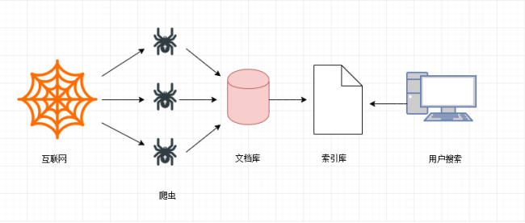

## 1、Python爬虫介绍

> 爬虫课程特点

课程不会教如何去套代码

主要是教你思路，让你自己学会如何去写

写作业不是目的，目的是熟悉代码以及学会代码的思路。

因为学员掌握的程度不一样，所以会从最简答的内容开始讲解，慢慢过渡的难的。

爬虫的实战性要求很强。爬虫经常需要爬取商业网站或政府网站的内容，而这些网站随时可能进行更新，另外网络原因和网站反爬虫机制也会对爬虫代码演示造成干扰。每次上课之前会先测试备课代码，但是如果网站更新发生在授课期间或者反爬虫机制触发，会尽量在短时间内尝试解决。如果问题很棘手，那么课堂上，请不要过度纠结这个具体问题。

### 1、1 爬虫的用处

**网络爬虫**：按照一定的规则，自动地抓取互联网信息的程序。

首先请问：都说现在是"大数据时代"，那数据从何而来？

- `企业产生的用户数据`：[百度指数](http://index.baidu.com)、[阿里指数](https://alizs.taobao.com)、[新浪微博指数](http://data.weibo.com/index) 
- `数据平台购买数据`：[数据堂](https://www.datatang.com/)、[国云数据市场](http://www.moojnn.com/data-market/)
- `政府/机构公开的数据`：[中华人民共和国国家统计局数据](http://data.stats.gov.cn/index.htm)、[世界银行公开数据](http://data.worldbank.org.cn)、[联合国数据](http://data.un.org)。
- `数据管理咨询公司`：[麦肯锡](http://www.mckinsey.com.cn)、[埃森哲](https://www.accenture.com/cn-zh/)、[艾瑞咨询](http://www.iresearch.com.cn) 
- `爬取网络数据`：如果需要的数据市场上没有，或者不愿意购买，那么可以选择招/做一名爬虫工程师，自己动手丰衣足食。[拉勾网Python爬虫职位](https://www.lagou.com/jobs/list_python爬虫) 

### 1、2 应用方向

#### 1、2、1 订制一个搜索引擎

​		**学习爬虫，可以私人订制一个搜索引擎，并且可以对搜索引擎的数据采集工作原理进行更深层次地理解。**

​		有的朋友希望能够深层次地了解搜索引擎的爬虫工作原理，或者希望自己能够开发出款私人搜索引擎，那么此时，学习爬虫是非常有必要的。简单来说，我们学会了爬虫编写之后，就可以利用爬虫自动地采集互联网中的信息，采集回来后进行相应的存储或处理，在需要检索某些信息的时候，只需在采集回来的信息中进行检索，即实现了私人的搜索引擎。当然，信息怎么爬取、怎么存储、怎么进行分词、怎么进行相关性计算等，都是需要我们进行设计的，爬虫技术主要解决信息爬取的问题。

#### 1、2、2 seo优化

​		对于很多SEO从业者来说，学习爬虫，可以更深层次地理解搜索引擎爬虫的工作原理，**从而可以更好地进行搜索引擎优化既然是搜索引擎优化，** 那么就必须要对搜索引擎的工作原理非常清楚，同时也需要掌握搜索引擎爬虫的工作原理，这样在进行搜索引擎优化时，才能知己知彼，百战不殆。

#### 1、2、3 数据分析

​		**大数据时代，要进行数据分析，首先要有数据源，而学习爬虫，可以让我们获取更多的数据源，并且这些数据源可以按我们的目的进行采集，去掉很多无关数据。** 

 		在进行大数据分析或者进行数据挖掘的时候，数据源可以从某些提供数据统计的网站获得，也可以从某些文献或内部资料中获得，但是这些获得数据的方式，有时很难满足我们对数据的需求，而手动从互联网中去寻找这些数据，则耗费的精力过大。此时就可以利用爬虫技术，自动地从互联网中获取我们感兴趣的数据内容，并将这些数据内容爬取回来，作为我们的数据源，从而进行更深层次的数据分析，并获得更多有价值的信息。

#### 1、2、4 找工作

​		**从就业的角度来说，爬虫工程师目前来说属于紧缺人才，并且薪资待遇普遍较高所以，深层次地掌握这门技术，对于就业来说，是非常有利的。** 

 		有些朋友学习爬虫可能为了就业或者跳槽。从这个角度来说，爬虫工程师方向是不错的选择之一，因为目前爬虫工程师的需求越来越大，而能够胜任这方面岗位的人员较少，所以属于一个比较紧缺的职业方向，并且随着大数据时代的来临，爬虫技术的应用将越来越广泛，在未来会拥有很好的发展空间。

### 1、3 为什么用Python爬虫

1. PHP：PHP是世界是最好的语言！！但他天生不是做这个的，而且对多线程、异步支持不是很好，并发处理能力弱。爬虫是工具性程序，对速度和效率要求比较高。据说目前PHP改善了效率，但是社区环境这一块还是赶不上Python。
2. Java：生态圈很完善，是Python爬虫最大的竞争对手。但是Java语言本身很笨重，代码量很大。重构成本比较高，任何修改会导致代码大量改动。爬虫经常要修改采集代码。毕竟人生苦短。。。。
3. C/C++：运行效率是无敌的。但是学习和开发成本高。写个小爬虫程序可能要大半天时间。一句话总结，为什么不用C++来开发爬虫程序，因为那是要头发掉光的，那是要死人的。
4. Python：语法优美、代码简洁、开发效率高、支持的模块多。相关的HTTP请求模块和HTML解析模块非常丰富。还有Scrapy和Scrapy-redis框架让我们开发爬虫变得异常简单。而且有非常丰富的资源，另外Python也支持异步，对异步的网络编程也非常友好。以后的方向是异步网络编程，非常适合爬虫程序！！

#### 1、3、1 一个 python 爬虫

使用 python 编写一个爬虫爬取百度网址

## 2、爬虫

### 2、1 爬虫的分类

#### 2、1、1 通用爬虫

​		通用网络爬虫是捜索引擎抓取系统（Baidu、Google、Sogou等）的一个重要组成部分。主要目的是将互联网上的网页下载到本地，形成一个互联网内容的镜像备份。为搜索引擎提供搜索支持。

**搜索引擎工作原理：**

- **第一步：抓取网页**

搜索引擎去成千上万个网站抓取数据。

- **第二步：数据存储**

搜索引擎通过爬虫爬取到的网页，将数据存入原始页面数据库(也就是文档库)。其中的页面数据与用户浏览器得到的HTML是完全一样的。

- **第三步：提供检索服务，网站排名**

搜索引擎将爬虫抓取回来的页面，进行各种步骤的预处理：中文分词，消除噪音，索引处理。

搜索引擎在对信息进行组织和处理后，为用户提供关键字检索服务，将用户检索相关的信息展示给用户。展示的时候会进行排名。

**搜索引擎的局限性：**

- 搜索引擎抓取的是整个网页，不是具体详细的信息。

- 搜索引擎无法提供针对具体某个客户需求的搜索结果。

#### 2、1、2 聚焦爬虫

​		针对通用爬虫的这些情况，聚焦爬虫技术得以广泛使用。聚焦爬虫，是"面向特定主题需求"的一种网络爬虫程序，它与通用搜索引擎爬虫的区别在于： **聚焦爬虫在实施网页抓取时会对内容进行处理筛选，尽量保证只抓取与需求相关的网页数据。**

我们课程后续学习的，是 **聚焦爬虫**。

### 2、2 **Robots协议**

​		robots是网站跟爬虫间的协议，用简单直接的txt格式文本方式告诉对应的爬虫被允许的权限，也就是说robots.txt是搜索引擎中访问网站的时候要查看的第一个文件。当一个搜索蜘蛛访问一个站点时，它会首先检查该站点根目录下是否存在robots.txt，如果存在，搜索机器人就会按照该文件中的内容来确定访问的范围；如果该文件不存在，所有的搜索蜘蛛将能够访问网站上所有没有被口令保护的页面。——百度百科

​		Robots协议也叫爬虫协议、机器人协议等，全称是“网络爬虫排除标准”（Robots Exclusion Protocol），**网站通过Robots协议告诉搜索引擎哪些页面可以抓取，哪些页面不能抓取**，例如：

淘宝：https://www.taobao.com/robots.txt

百度：https://www.baidu.com/robots.txt

## 3、请求与响应

HTTP通信由两部分组成： **客户端请求消息** 与 **服务器响应消息**

**浏览器发送HTTP请求的过程：**

1. 当我们在浏览器输入URL https://www.baidu.com 的时候，浏览器发送一个Request请求去获取 https://www.baidu.com 的html文件，服务器把Response文件对象发送回给浏览器。
2. 浏览器分析Response中的 HTML，发现其中引用了很多其他文件，比如Images文件，CSS文件，JS文件。 浏览器会自动再次发送Request去获取图片，CSS文件，或者JS文件。 
3. 当所有的文件都下载成功后，网页会根据HTML语法结构，完整的显示出来了。

**实际上我们通过学习爬虫技术爬取数据, 也是向服务器请求数据, 获取服务器响应数据的过程。**

## 4、chrome 开发者工具

​		当我们爬取不同的网站是，每个网站页面的实现方式各不相同，我们需要对每个网站都进行分析。那是否有一些通用的分析方法？我分享下自己爬取分析的“套路”。在某个网站上，分析页面以及抓取数据，我用得最多的工具是 **Chrome 开发者工具**。

 		Chrome 开发者工具是一套内置于 Google Chrome 中的 Web 开发和调试工具，可用来对网站进行迭代、调试和分析。因为国内很多浏览器内核都是基于 Chrome 内核，所以国产浏览器也带有这个功能。例如：UC 浏览器、QQ 浏览器、360 浏览器等。

接下来，我们来看看 Chrome 开发者工具一些比较牛逼的功能。

### 4、1 元素面板（Elements)

​		通过元素（Element）面板，我们能查看到想抓取页面渲染内容所在的标签、使用什么 CSS 属性（例如：class="middle"）等内容。例如我想要抓取我知乎主页中的动态标题，在网页页面所在处上右击鼠标，选择“检查”，可进入 Chrome 开发者工具的元素面板。

​		通过这种方法，我们能快速定位出页面某个 DOM 节点，然后可以提取出相关的解析语句。鼠标移动到节点，然后右击鼠标，选择 “Copy”，能快速复制出 Xpath 、CSS selector 等内容解析库的解析语句。

### 4、2 控制台面板（Console）

控制台面板（Console）是用于显示JS和DOM对象信息的单独窗口。

在爬虫课程的js解密专题会用控制台功能调试运行js代码。

### 4、3 资源面板（Source）

在资源面板（Source）页面可以查看到当前网页的所有源文件。

在左侧栏中可以看到源文件以树结构进行展示。
在中间栏这个地方使用来调试js代码的地方。
右侧是断点调试功能区。
在后续js解密会用到资源面板的功能

### 4、4 网络面板（Network）

网络（Network）面板记录页面上每个网络操作的相关信息，包括详细的耗时数据、HTTP 请求与响应标头和 Cookie，等等。这就是我们通常说的抓包。

#### 4、4、1 工具栏

**Stop recording network log**

默认情况下，只要开发者工具在开启状态，会记录所有的网络请求，当然，记录都是在Network 面板展示的。红色表示开启，灰色表示关闭。

**Clear**

清空所有数据，每一次重新分析是都需要清空之前的数据。

**Filter**

数据包过滤器。红色表示打开，蓝色表示关闭。

经常来使用它来过滤出一些 HTTP 请求，例如过滤出使用 Ajax 发起的异步请求、图片、视频等。

最大的窗格叫 **Requests Table**，此表格会列出了检索的每一个 HTTP 请求。默认情况下，此表格按时间顺序排序，最早的资源在顶部。点击资源的名称可以显示更多信息。

**Requests Table参数：**

* **all：**所有请求数据（图片、视频、音频、js代码、css代码* ）
* **XHR：**XMLHttpRequest 的缩写，是ajax技术的核心，动态加载完成经常分析的一个内容
* **CSS:  **css样式文件
* **JS：**JavaScript文件，是js解密常分析的一个页面
* **Img：** Images 图片文件
* **Font：** 字体文件（字体反扒）
* **DOC ：** Document，文档内容
* **WS:  **WebSocket，web端的socket数据通信，一般用于一些实时更新的数据
* **Manifest：**显示通过manifest缓存的资源。包括很多信息，如js库文件会显示文件地址、大小和
  类型；

**Search**

搜索框，只要在 ALL 里面出现的过的内容，就可以被直接搜索到。常用与数据检索与 JS 解密

**Preserve log**

保留日志。当分析在多个页面跳转的内容时，一定要勾上，不然当页面发生新的跳转是，历史数据全部都会被清空。保留日志，做爬虫是一定需要勾上

**Disable cache**

清空 JavaScript、css 文件的缓存，获取最新的。

**Hide data URLs**

用于是否隐藏dataurl，那么什么是dataurl呢？传统的通常img标记的src属性指定了一个远程服务器的资源，浏览器针对每个外部资源需要向服务器发送一次拉取资源请求。而Data URL技术是图片数据以base64字符串格式嵌入到了页面中，和HTML融为一体。

**Has blocked cookies**

仅显示具有阻止响应cookie的请求，此选项千万不要勾选。

**Blocked Requests**

仅显示被阻止的请求，此选项千万不要勾选。

**3rd-party requests**

仅显示来源与页面来源不同的请求，此选项千万不要勾选。

### 4、5 Requests详情：

**请求头**
**Headers**：是显示 HTTP 请求的 Headers，我们通过这个能看到请求的方式，以及携带的请求参数等。

* General

  **Request url** ：实际请求的网址
  **Request Method**： 请求方法
  **Status Code** ：状态码，成功时为 200

* Response Headers

  服务器返回时设置的一些数据，例如服务器更新的cookie数据最新是在这里出现修改

* Requests Headers

  请求体，请求不到数据的原因一般出在这里。反扒也是反扒请求体里面的数据
  **Accept**：服务器接收的数据格式（一般忽略）
  **Accept-Encoding**: 服务器接收的编码（一般忽略）
  **Accept-Language**: 服务器接收的语言（一般忽略）
  **Connection**: 保持连接（一般忽略）
  **Cookies**： cookies信息，是身份信息，爬取VIP资源是需要携带身份信息
  **Host**: 请求的主机地址
  **User-Agent**: 用户身份代理，服务器根据这个判断用户的大概信息
  **Sec-xxx-xxx**: 其他信息，可能没用，可能是反扒。具体情况具体分析*

**Preview**

​		Preview 是请求结果的预览。一般用来查看请求到的图片，对于抓取图片网站比较给力。

**Response**

​		Response 是请求返回的结果。一般的内容是整个网站的源代码。如果该请求是异步请求，返回的结果内容一般是 Json 文本数据。

此数据与浏览器展示的网页可能不一致，因为浏览器是动态加载的

**Initiator**

​		请求发起所调用的堆栈

**Timing**

​		请求与响应时间表

## 课外拓展HTTP 传输

https://mp.weixin.qq.com/s/aSwXVrz47lAvQ4k0o4VcZg