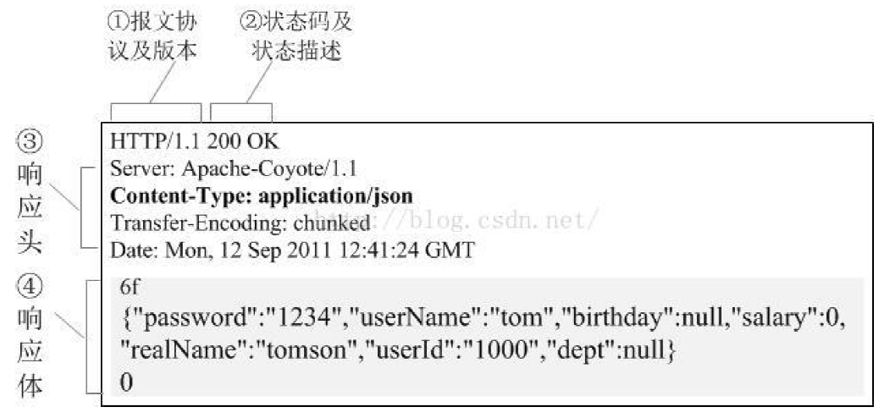

## 1、HTTP/HTTPS

* HTTP协议（HyperText Transfer Protocol，超文本传输协议）：是一种发布和接收HTML页面的
  方法。
* HTTPS（Hypertext Transfer Protocol over Secure Socket Layer）简单讲是HTTP的安全版，在
  HTTP下加入SSL层。

### 1、1 HTTP/HTTPS的优缺点

**HTTP 的缺点：**

* 通信使用明文（不加密），内容可能会被窃听
* 不验证通信方的身份，因此有可能遭遇伪装
* 无法证明报文的完整性，所以有可能已遭篡改

**HTTPS的优点：**

为了解决 HTTP 协议的以上缺点，在上世纪90年代中期，由网景（NetScape）公司设计了 SSL 协议。
SSL 是“Secure Sockets Layer”的缩写，中文叫做“**安全套接层**”。

SSL（Secure Sockets Layer 安全套接层）主要用于Web的安全传输协议，在传输层对网络连接进行加
密，保障在Internet上数据传输的安全。

### 1、2 请求与响应概述

HTTP通信由两部分组成： **客户端请求消息** 与 **服务器响应消息**

**浏览器发送HTTP请求的过程：**

1. 当我们在浏览器输入URL https://www.baidu.com 的时候，浏览器发送一个Request请求去获取 h
ttps://www.baidu.com 的html文件，服务器把Response文件对象发送回给浏览器。
2. 浏览器分析Response中的 HTML，发现其中引用了很多其他文件，比如Images文件，CSS文件，
JS文件。 浏览器会自动再次发送Request去获取图片，CSS文件，或者JS文件。
3. 当所有的文件都下载成功后，网页会根据HTML语法结构，完整的显示出来了。

### 1、3 请求

#### 1、3、1 请求目标（URL）

​		URL又叫作统一资源定位符，是用于完整地描述Internet上网页和其他资源的地址的一种方法。类
似于Windows的文件路径。

**一个网址的组成：**

1. http://: 这个是协议，也就是HTTP超文本传输协议，也就是网页在网上传输的协议。
2. mail：这个是服务器名，代表着是一个邮箱服务器，所以是mail。
3. 163.com: 这个是域名，是用来定位网站的独一无二的名字。
4. mail.163.com： 这个是网站名，由服务器名+域名组成。
5. /： 这个是根目录，也就是说，通过网站名找到服务器，然后在服务器存放网页的根目录。
6. index.html： 这个是根目录下的网页。
7. http://mail.163.com/index.html: 这个叫做URL，统一资源定位符，全球性地址，用于定位网上
的资源。

#### 1、3、2 请求体（response）

​		就像打电话一样，HTTP到底和服务器说了什么，才能让服务器返回正确的消息的，其实客户端的
请求告诉了服务器这些内容：**请求行**、**请求头部**、**空行**、**请求数据**

#### 1、3、3 请求方法（Method）

HTTP请求可以使用多种请求方法，但是爬虫最主要就两种方法：GET和POST方法。

1. `get` 请求：一般情况下，只从服务器获取数据下来，并不会对服务器资源产生任何影响的时候会
    使用 `get` 请求。
2. `post` 请求：向服务器发送数据（登录）、上传文件等，会对服务器资源产生影响的时候会使用
    `post` 请求。

​	以上是在网站开发中常用的两种方法。并且一般情况下都会遵循使用的原则。但是有的网站和服务器为了做反爬虫机制，也经常会不按常理出牌，有可能一个应该使用get 方法的请求就一定要改 成post 请求，这个要视情况而定。

**GET与POST方法的区别：**

1. GET是从服务器上获取数据，POST是向服务器传送数据
2. GET请求参数都显示在浏览器网址上，即“Get”请求的参数是URL的一部分。 例如： http://www.baidu.com/s?wd=Chinese
3. POST请求参数在请求体当中，消息长度没有限制而且以隐式的方式进行发送，通常用来向HTTP服
    务器提交量比较大的数据。请求的参数类型包含在“Content-Type”消息头里，指明发送请求时要提
    交的数据格式。

**注意：**

​		网站制作者一般不会使用Get方式提交表单，因为有可能会导致安全问题。 比如说在登陆表单中用
Get方式，用户输入的用户名和密码将在地址栏中暴露无遗。并且浏览器会记录历史信息，导致账号不
安全的因素存在。

#### 1、3、4 常用的请求报头

​		请求头描述了客户端向服务器发送请求时所使用的编码，以及发送内容的长度，告诉服务器自己有
没有登陆，采用的什么浏览器访问的等等。

1. `Accept` ：浏览器告诉服务器自己接受什么数据类型，文字，图片等。
2. `Accept-Charset` ：浏览器申明自己接收的字符集。
3. `Accept-Encoding` ：浏览器申明自己接收的编码方法，通常指定压缩方法，是否支持压缩，支持
什么压缩方法 (gzip， deflate， br)。
4. `Accept-Language` ：浏览器申明自己接收的语言。
5. `Authorization` ：授权信息，通常出现在对服务器发送的WWW-Authenticate头的应答中。
6. `Content-Length` 表示请求消息正文的长度。
7. `origin` ：声明请求资源的起始位置
8. `Connection` ：处理完这次请求后，是断开连接还是继续保持连接。
9. `Cookie` ：发送给WEB服务器的Cookie内容，经常用来判断是否登陆了。
10. `Host` ：客户端指定自己想访问的WEB服务器的域名/IP 地址和端口号。
11. `If-Modified-Since` ：客户机通过这个头告诉服务器，资源的缓存时间。只有当所请求的内容在指定的时间后又经过修改才返回它，否则返回304“Not Modified”应答。
12. `Pragma` ：指定“no-cache”值表示服务器必须返回一个刷新后的文档，即使它是代理服务器而且已
经有了页面的本地拷贝。
13. `Referer` ：告诉服务器该页面从哪个页面链接的。
14. `From` ：请求发送者的email地址，由一些特殊的Web客户程序使用，浏览器不会用到它。
15. `User-Agent` ：浏览器表明自己的身份 (是哪种浏览器)
16. `Upgrade-insecure-requests` ：申明浏览器支持从 http 请求自动升级为 https 请求，并且在以后
发送请求的时候都使用 https。

`UA-Pixels,UA-Color,UA-OS,UA-CPU：由某些版本的IE浏览器所发送的非标准的请求头，表示屏幕大小、颜色深度、操作系统和CPU类型。`

#### 1、3、5 requests模块查看请求体

​		在我们用requests模块请求数据的时候携带上诉请求报头的字段信息，将我们的爬虫代码进行伪
装。同样的伪装之后我们也可以通过代码查看请求体的字段信息，有如下几种常见的属性：

~~~python
# 查看请求体中的url地址
response.request.url
# 查看请求体中的请求头信息
response.request.headers
# 查看请求体中的请求方法
response.request.method
~~~

### 1、4 响应

#### 1、4、1 HTTP响应报文

HTTP响应报文也由三部分组成：**响应行**、**响应头**、**响应体**

HTTP响应报文格式就如下图所示：

**响应行**

​		响应行一般由协议版本、状态码及其描述组成 比如 HTTP/1.1 200 OK

​		其中协议版本HTTP/1.1或者HTTP/1.0，200就是它的状态码，OK则为它的描述。

**响应头**

​		响应头用于描述服务器的基本信息，以及数据的描述，服务器通过这些数据的描述信息，可以通知
客户端如何处理等一会儿它回送的数据。

​		设置HTTP响应头往往和状态码结合起来。例如，有好几个表示“文档位置已经改变”的状态代码都伴
随着一个Location头，而401(Unauthorized)状态代码则必须伴随一个WWW-Authenticate头。然而，
即使在没有设置特殊含义的状态代码时，指定应答头也是很有用的。应答头可以用来完成：设置
Cookie，指定修改日期，指示浏览器按照指定的间隔刷新页面，声明文档的长度以便利用持久HTTP连
接等许多其他任务。

**常见的响应头字段含义：**

`Allow` ：服务器支持哪些请求方法(如GET、POST等)。
`Content-Encoding` ：文档的编码(Encode)方法。只有在解码之后才可以得到Content-Type头指定的内容类型。利用gzip压缩文档能够显著地减少HTML文档的下载时间。
`Content-Length` ：表示内容长度。只有当浏览器使用持久HTTP连接时才需要这个数据。

`Content- Type` ：表示后面的文档属于什么MIME类型。Servlet默认为text/plain，但通常需要显式地
指定为text/html。由于经常要设置 Content-Type，因此HttpServletResponse提供了一个专用的方法
setContentType。
`Date` ：当前的GMT时间，例如，Date:Mon，31Dec200104:25:57GMT。Date描述的时间表示世界标
准时，换算成本地时间，需要知道用户所在的时区。你可以用setDateHeader来设置这个头以避免转换
时间格式的麻烦。
`Expires` ：告诉浏览器把回送的资源缓存多长时间，-1或0则是不缓存。
`Last-Modified` ：文档的最后改动时间。客户可以通过If-Modified-Since请求头提供一个日期，该请求将被视为一个条件GET，只有改动时间迟于指定时间的文档才会返回，否则返回一个304(Not Modified)状态。Last-Modified也可用setDateHeader方法来设置。
`Location` ：这个头配合302状态码使用，用于重定向接收者到一个新 url 地址。表示客户应当到哪里
去提取文档。Location通常不是直接设置的，而是通过HttpServletResponse的sendRedirect方法，该
方法同时设置状态代码为302。
`Refresh` ：告诉浏览器隔多久刷新一次，以秒计。
`Server` ：服务器通过这个头告诉浏览器服务器的类型。Server响应头包含处理请求的原始服务器的软
件信息。此域能包含多个产品标识和注释，产品标识一般按照重要性排序。Servlet一般不设置这个值，
而是由Web服务器自己设置。

`Set-Cookie` ：设置和页面关联的Cookie。Servlet不应使用response.setHeader(“Set-Cookie”， …)，
而是应使用HttpServletResponse提供的专用方法addCookie。
`Transfer-Encoding` ：告诉浏览器数据的传送格式。
`WWW-Authenticate` ：客户应该在Authorization头中提供什么类型的授权信息?在包含
401(Unauthorized)状态行的应答中这个头是必需的。
`setContentType` ：设置Content-Type头。大多数Servlet都要用到这个方法。
`setContentLength` ：设置Content-Length头。对于支持持久HTTP连接的浏览器来说，这个函数是很
有用的。
`addCookie` ：设置一个Cookie(Servlet API中没有setCookie方法，因为应答往往包含多个Set-Cookie
头)。

**响应体**

​		响应体就是响应的消息体，如果是纯数据就是返回纯数据，如果请求的是HTML页面，那么返回的
就是HTML代码，如果是JS就是JS代码，如此之类。

**响应内容**

​		看到的html、css、js、图片、视频、音频等返回的数据

#### 1、4、2 常见的响应方法

~~~python
# 获取响应体文本数据
response.text
# 获取响应体二进制数据
response.content
# 获取响应体json数据
response.json()
# 获取响应体响应头信息
response.headers
# 设置响应体的编码
response.encoding
# 自动识别响应体的编码
response.apparent_encoding
# 获取响应体的cookies信息,获取到的是cookiejar对象
response.cookies
# 获取响应体的url地址
response.url
# 获取响应体的状态码
response.status_code
~~~

#### 1、4、3 状态码

响应状态码可以很方便的查看我们的响应状态，我们可以检测响应状态码：
1. 200 ：请求正常，服务器正常的返回数据。
2. 301 ：永久重定向。比如在访问www.jingdong.com 的时候会重定向到www.jd.com 。
3. 302 ：临时重定向。比如在访问一个需要登录的页面的时候，而此时没有登录，那么就会重定向
到登录页面。
4. 400 ：请求的url 在服务器上找不到。换句话说就是请求url 错误。
5. 403 ：服务器拒绝访问，权限不够。
6. 500 ：服务器内部错误。可能是服务器出现bug 了。

## 参考阅读：编码

​		很久很久以前，有一群人，他们决定用8个可以开合的晶体管来组合成不同的状态，以表示世界上
的万物。他们看到8个开关状态是好的，于是他们把这称为"字节"。
​		再后来，他们又做了一些可以处理这些字节的机器，机器开动了，可以用字节来组合出很多状态，
状态开始变来变去。他们看到这样是好的，于是它们就这机器称为"计算机"。
​		开始计算机只在美国用。八位的字节一共可以组合出256(2的8次方)种不同的状态。
​		他们把其中的编号从0开始的32种状态分别规定了特殊的用途，一但终端、打印机遇上约定好的这
些字节被传过来时，就要做一些约定的动作。遇上00x10， 终端就换行，遇上0x07， 终端就向人们嘟
嘟叫，例好遇上0x1b， 打印机就打印反白的字，或者终端就用彩色显示字母。他们看到这样很好，于
是就把这些0x20以下的字节状态称为"控制码"。
​		他们又把所有的空格、标点符号、数字、大小写字母分别用连续的字节状态表示，一直编到了第
127号，这样计算机就可以用不同字节来存储英语的文字了。大家看到这样，都感觉很好，于是大家都
把这个方案叫做 ANSI 的"Ascii"编码（American Standard Code for Information Interchange，美国
信息互换标准代码）。当时世界上所有的计算机都用同样的ASCII方案来保存英文文字。
​		后来，就像建造巴比伦塔一样，世界各地的都开始使用计算机，但是很多国家用的不是英文，他们
的字母里有许多是ASCII里没有的，为了可以在计算机保存他们的文字，他们决定采用127号之后的空位
来表示这些新的字母、符号，还加入了很多画表格时需要用下到的横线、竖线、交叉等形状，一直把序
号编到了最后一个状态255。从128到255这一页的字符集被称"扩展字符集"。从此之后，贪婪的人类再
没有新的状态可以用了，美帝国主义可能没有想到还有第三世界国家的人们也希望可以用到计算机吧！

​		等中国人们得到计算机时，已经没有可以利用的字节状态来表示汉字，况且有6000多个常用汉字需要保存呢。但是这难不倒智慧的中国人民，我们不客气地把那些127号之后的奇异符号们直接取消掉，规定：一个小于127的字符的意义与原来相同，但两个大于127的字符连在一起时，就表示一个汉字，前面的一个字节（他称之为高字节）从0xA1用到0xF7，后面一个字节（低字节）从0xA1到0xFE，这样我们就可以组合出大约7000多个简体汉字了。在这些编码里，我们还把数学符号、罗马希腊的字母、日文的假名们都编进去了，连在 ASCII 里本来就有的数字、标点、字母都统统重新编了两个字节长的编码，这就是常说的"全角"字符，而原来在127号以下的那些就叫"半角"字符了。

​		中国人民看到这样很不错，于是就把这种汉字方案叫做 "GB2312"。GB2312 是对 ASCII 的中文扩
展。

​		但是中国的汉字太多了，我们很快就就发现有许多人的人名没有办法在这里打出来，特别是某些很
会麻烦别人的国家领导人。于是我们不得不继续把 GB2312 没有用到的码位找出来老实不客气地用上。

​		后来还是不够用，于是干脆不再要求低字节一定是127号之后的内码，只要第一个字节是大于127
就固定表示这是一个汉字的开始，不管后面跟的是不是扩展字符集里的内容。结果扩展之后的编码方案
被称为 GBK 标准，GBK 包括了 GB2312 的所有内容，同时又增加了近20000个新的汉字（包括繁体
字）和符号。

​		后来少数民族也要用电脑了，于是我们再扩展，又加了几千个新的少数民族的字，GBK 扩成了
GB18030。从此之后，中华民族的文化就可以在计算机时代中传承了。

​		中国的程序员们看到这一系列汉字编码的标准是好的，于是通称他们叫做 "DBCS"（Double Byte
Charecter Set 双字节字符集）。在DBCS系列标准里，最大的特点是两字节长的汉字字符和一字节长的
英文字符并存于同一套编码方案里，因此他们写的程序为了支持中文处理，必须要注意字串里的每一个
字节的值，如果这个值是大于127的，那么就认为一个双字节字符集里的字符出现了。那时候凡是受过
加持，会编程的计算机僧侣们都要每天念下面这个咒语数百遍：

​		"一个汉字算两个英文字符！一个汉字算两个英文字符……"

​		因为当时各个国家都像中国这样搞出一套自己的编码标准，结果互相之间谁也不懂谁的编码，谁也
不支持别人的编码，连大陆和台湾这样只相隔了150海里，使用着同一种语言的兄弟地区，也分别采用
了不同的 DBCS 编码方案——当时的中国人想让电脑显示汉字，就必须装上一个"汉字系统"，专门用来
处理汉字的显示、输入的问题，但是那个台湾的愚昧封建人士写的算命程序就必须加装另一套支持
BIG5 编码的什么"倚天汉字系统"才可以用，装错了字符系统，显示就会乱了套！这怎么办？而且世界民
族之林中还有那些一时用不上电脑的穷苦人民，他们的文字又怎么办？

​		真是计算机的巴比伦塔命题啊！

​		正在这时，大天使加百列及时出现了——一个叫 ISO （国际标谁化组织）的国际组织决定着手解决
这个问题。他们采用的方法很简单：废了所有的地区性编码方案，重新搞一个包括了地球上所有文化、
所有字母和符号的编码！他们打算叫它"Universal Multiple-Octet Coded Character Set"，简称 UCS，
俗称 "UNICODE"。

​		UNICODE 开始制订时，计算机的存储器容量极大地发展了，空间再也不成为问题了。于是 ISO 就
直接规定必须用两个字节，也就是16位来统一表示所有的字符，对于ascii里的那些“半角”字符，
UNICODE 包持其原编码不变，只是将其长度由原来的8位扩展为16位，而其他文化和语言的字符则全
部重新统一编码。由于"半角"英文符号只需要用到低8位，所以其高8位永远是0，因此这种大气的方案
在保存英文文本时会多浪费一倍的空间。

​		这时候，从旧社会里走过来的程序员开始发现一个奇怪的现象：他们的strlen函数靠不住了，一个
汉字不再是相当于两个字符了，而是一个！是的，从 UNICODE 开始，无论是半角的英文字母，还是全
角的汉字，它们都是统一的"一个字符"！同时，也都是统一的"两个字节"，请注意"字符"和"字节"两个术
语的不同，“字节”是一个8位的物理存贮单元，而“字符”则是一个文化相关的符号。在UNICODE 中，一
个字符就是两个字节。一个汉字算两个英文字符的时代已经快过去了。

​		从前多种字符集存在时，那些做多语言软件的公司遇上过很大麻烦，他们为了在不同的国家销售同
一套软件，就不得不在区域化软件时也加持那个双字节字符集咒语，不仅要处处小心不要搞错，还要把
软件中的文字在不同的字符集中转来转去。UNICODE 对于他们来说是一个很好的一揽子解决方案，于
是从 Windows NT 开始，MS 趁机把它们的操作系统改了一遍，把所有的核心代码都改成了用
UNICODE 方式工作的版本，从这时开始，WINDOWS 系统终于无需要加装各种本土语言系统，就可以
显示全世界上所有文化的字符了。

​		但是，UNICODE 在制订时没有考虑与任何一种现有的编码方案保持兼容，这使得 GBK 与
UNICODE 在汉字的内码编排上完全是不一样的，没有一种简单的算术方法可以把文本内容从UNICODE
编码和另一种编码进行转换，这种转换必须通过查表来进行。
​		如前所述，UNICODE 是用两个字节来表示为一个字符，他总共可以组合出65535不同的字符，这
大概已经可以覆盖世界上所有文化的符号。如果还不够也没有关系，ISO已经准备了UCS-4方案，说简
单了就是四个字节来表示一个字符，这样我们就可以组合出21亿个不同的字符出来（最高位有其他用
途），这大概可以用到银河联邦成立那一天吧！
​		UNICODE 来到时，一起到来的还有计算机网络的兴起，UNICODE 如何在网络上传输也是一个必
须考虑的问题，于是面向传输的众多 UTF（UCS Transfer Format）标准出现了，顾名思义，UTF8就是
每次8个位传输数据，而UTF16就是每次16个位，只不过为了传输时的可靠性，从UNICODE到UTF时并
不是直接的对应，而是要过一些算法和规则来转换。

### 总结

字符(Character)是各种文字和符号的总称，包括各国家文字、标点符号、图形符号、数字等。字
符集(Character set)是多个字符的集合
字符集包括：ASCII字符集、GB2312字符集、GB18030字符集、Unicode字符集等
ASCII编码是1个字节，而Unicode编码通常是2个字节。
UTF-8是Unicode的实现方式之一，UTF-8是它是一种变长的编码方式，可以是1，2，3个字节